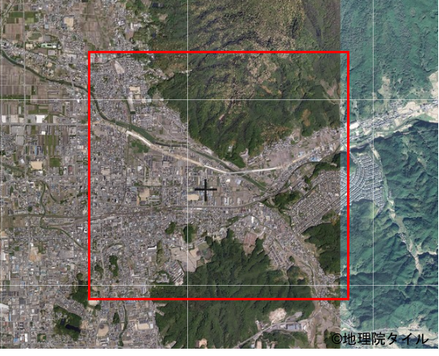
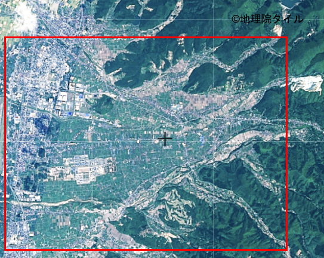

# 地形確認テスト
地理の教科書の地形の単元を読み、次の地形の名称とそのように考えた理由（各150字程度）を以下のフォームより入力してください。

## 設問
以下の設問をクリックすると地理院地図のページが表示されます。地理院地図の機能を利用し、以下の設問の地形を回答してください。

### [設問1](https://maps.gsi.go.jp/#14/34.515905/135.859110/)

### [設問2](https://maps.gsi.go.jp/#14/34.153395/135.206375)

### [設問3](https://maps.gsi.go.jp/#15/34.448451/131.411774/)

### [設問4](https://maps.gsi.go.jp/#15/34.405940/131.182660/)

### [設問5](https://maps.gsi.go.jp/#16/33.466612/131.697362/)※ 集落のある位置の地形

### [設問6](https://maps.gsi.go.jp/#13/38.411123/140.431783/)

### [設問7](https://maps.gsi.go.jp/#15/35.876357/140.310504/)※ 集落のある位置の地形

### [設問8](https://maps.gsi.go.jp/#14/35.706774/140.735058)

### [設問9](https://maps.gsi.go.jp/#15/34.648543/137.790830)

### [設問10](https://maps.gsi.go.jp/#13/34.528739/136.735996)

